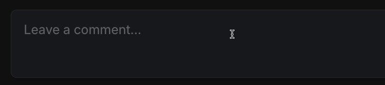

# tyop

**tyop** *(a typo of "typo")* is a macOS menu bar app that fixes typos in whatever you're typing, on demand.

<p align="center">
  
</p>

Press **Ctrl+.** while a text field is focused — tyop reads the text, fixes typos, and writes it back. No AI, no internet connection, no API keys. Runs entirely offline.

## What it fixes (and doesn't)

**Does fix:**
- Transposed characters: `teh` → `the`, `helol` → `hello`
- Missing letters: `mnth` → `month`, `wel` → `well`
- Extra letters: `yopu` → `you`
- Contractions typed without apostrophe: `dont` → `don't`, `im` → `I'm`, `theyre` → `they're`
- Semicolons hit instead of apostrophe: `don;t` → `don't`, `i;m` → `i'm`
- Capitalisation after `.`, `!`, `?` — but only if the text already contains capitals (so all-lowercase messages stay lowercase)
- Common misspellings: `recieve` → `receive`, `seperate` → `separate`
- Punctuation spacing: `hello ,friend` → `hello, friend`, `wait !` → `wait!`

**Does not fix:**
- Grammar (beyond the basics above)
- Word choice errors (`their` vs `there` vs `they're` — all are valid words)
- Proper nouns — capitalised words mid-sentence are left alone
- Text longer than 1 KB — tyop is designed for instant messages, chat, short emails, not documents

## Requirements

- macOS 12+
- Accessibility permission (see below)

## Install

```sh
brew tap liamg/tap
brew install --cask tyop && xattr -cr /Applications/tyop.app
open /Applications/tyop.app
```

On first launch, macOS will ask for Accessibility permission — tyop needs this to read and write text fields in other apps:

**System Settings → Privacy & Security → Accessibility → enable tyop**

Without this permission tyop won't work at all.

> **Note:** tyop is not notarised (that requires a $99/yr Apple Developer account). The `xattr` command removes the quarantine flag macOS adds to downloaded apps — without it macOS will refuse to open tyop.

## Usage

1. Click into any text field
2. Press **Ctrl+.** — tyop corrects the text instantly

Works in most native macOS apps and Electron apps (Slack, VS Code, etc.). The app must support the macOS Accessibility API — a small number of apps don't, and tyop will silently do nothing in those.

For apps that support reading but not writing via the Accessibility API (such as **Zed**), tyop falls back to a clipboard-based method: it saves your clipboard, sets the corrected text, sends **Cmd+A** then **Cmd+V** to replace the field contents, and restores your original clipboard shortly after. You can disable this fallback via **Clipboard Fallback** in the menu bar if you'd prefer tyop to do nothing in those apps.

## Menu bar

Click the **tyop** menu bar icon to:

| Option | Description |
|--------|-------------|
| Enabled | Toggle tyop on/off without quitting |
| English (UK) / English (US) | Switch spelling variant |
| Hotkey | Change the trigger shortcut (Ctrl+. / Ctrl+, / Ctrl+;) |
| Launch at Login | Start tyop automatically at login |
| Clipboard Fallback | Use clipboard+Cmd+A/V for apps that don't support AX writes (e.g. Zed) |
| Quit tyop | Exit |

Settings are saved to `~/Library/Application Support/tyop/config.json` and restored on next launch.

## Build from source

Requires macOS and Go 1.21+.

```sh
git clone https://github.com/liamg/tyop
cd tyop
go build -ldflags="-X main.version=dev" -o tyop.app/Contents/MacOS/tyop .
rm -rf /Applications/tyop.app
cp -r tyop.app /Applications/
open /Applications/tyop.app
```

> **Note:** Every time you rebuild and reinstall, macOS will see it as a new binary and revoke Accessibility access. Go to **System Settings → Privacy & Security → Accessibility**, remove the old tyop entry, re-add `/Applications/tyop.app` and re-enable it.

---

## How it works

When the hotkey fires, tyop:

1. Uses the macOS [Accessibility API](https://developer.apple.com/documentation/accessibility) (AX) to find the focused text element in the frontmost app
2. Reads the full text value
3. Runs the correction pipeline (see below)
4. Writes the corrected text back via AX API and moves the cursor to the end — if the app doesn't support AX writes (e.g. Zed), falls back to clipboard + Cmd+A/Cmd+V

For Electron/Chromium apps (Slack, VS Code, etc.), tyop first enables `AXEnhancedUserInterface` on the app, which unlocks the accessibility tree — this adds a ~500ms delay on first use per app.

### Correction pipeline

Each run processes the text through these stages in order:

**1. Semicolon preprocessing**  
Replaces `;` with `'` between letters, but only when the result is a known word or contraction. So `don;t` → `don't`.

**2. Tokenisation**  
Text is split into word tokens (letters + apostrophes) and non-word tokens (spaces, punctuation, numbers). Non-word tokens are passed through unchanged.

**3. Per-word correction**

For each word token:

- **Autocorrect map** — checked first. Covers contractions without apostrophes (`dont` → `don't`), `i` → `I`, and ~80 common misspellings (`teh`, `recieve`, etc.). Results are lowercased if the text has no capitals anywhere.

- **Spell checker** — runs only on words not in the dictionary, and skips mid-sentence capitalised words (treated as proper nouns). Tries corrections in priority order:
  1. **Transpositions** (swap two adjacent characters) checked against the frequency dictionary — most common typo type
  2. **Insertions** (add one missing character) checked against frequency dictionary
  3. **Deletions** (remove one extra character) checked against frequency dictionary
  4. **Edit distance 2** — all of the above applied twice, via intermediate candidates; only uses the frequency dictionary; prefers rearrangements (same characters, different order) over substitutions
  5. **Full dictionary fallback** — uses the 370k-word list for ED1 candidates, but only when exactly one unambiguous match exists

  When multiple candidates exist in the frequency dictionary, the highest-frequency word wins.

- **Space split** — before letter-level corrections, checks if inserting a space produces two valid words (e.g. `ifi` → `if i`)

**4. Sentence capitalisation**  
Only applied if the text already contains at least one capital letter. Capitalises the first word and any word following `.`, `!`, or `?`.

### Word lists

Two embedded word lists (gzipped, ~1.6 MB total):

- **Frequency dictionary** (`freq_en.txt.gz`) — ~83k English words with corpus frequency scores, from [symspellpy](https://github.com/mammothb/symspellpy) (MIT licence, © Wolf Garbe). Used for candidate scoring and primary spell checking.
- **Full word list** (`words_en.txt.gz`) — ~370k English words from [dwyl/english-words](https://github.com/dwyl/english-words) (Unlicense). Used only as a fallback for rare/obscure words.

See `LICENSES/` for third-party licence notices.

---

## Licence

This software is released into the public domain under the [Unlicense](UNLICENSE).

Third-party word lists have their own licences — see [`LICENSES/`](LICENSES/).
